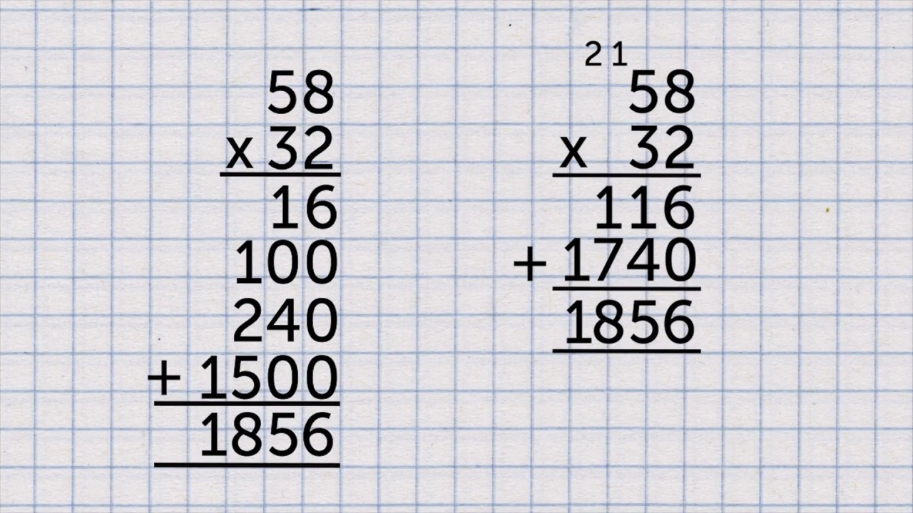
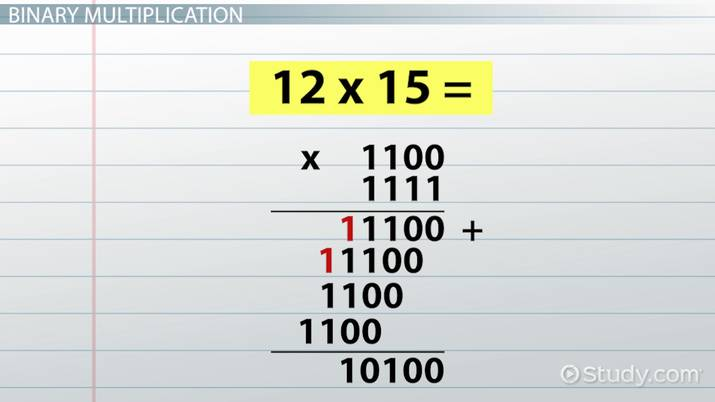
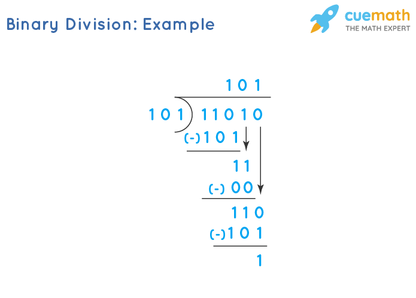

# Overview: Although we already have a short-version of ideaiton in github repo issue, I have made more detailed plan by reffering to teacher's ideation example. 
1. The topic: The topic we chose is binary multiplication and division though we are still discussing about the topic for the binary logic project

# About binary multiplication and division:
2. Binary multiplication:
- Binary multiplication works same as the step for multiplication of numbers. For example, when you multiply 58 and 32, this step is how you usually multiply numbers:

 To multiply 58 by 32, multiply the units digit (8) by the tens digit (3) to get 24. Next, multiply the units digit (8) by the units digit (2) and place a zero next to it, resulting in 160. Finally, add these two products together to get the final answer: 1856. 
- Now, when you multiply in terms of binary, all you have to do is to replace 58 and 32 with 111010 and 100000 which are binary numebrs for 58 and 32. And then repeat the same process as multilication of numbers. 
- For example, when you multiply binary numbers 1100 and 1111 which are multiplication of 12 and 15, you follow the step of number multiplication. 

3. Binary division: 
- It's the same thing as the step for division of numbers. All you have to do is to replace numbers with binary numbers that represent numbers replaced. Here's binary number, 101 divided by 101 (5 divided by 5), which is same as the process of number division. 

# Now, about the coding process that represents this binary concept. 
