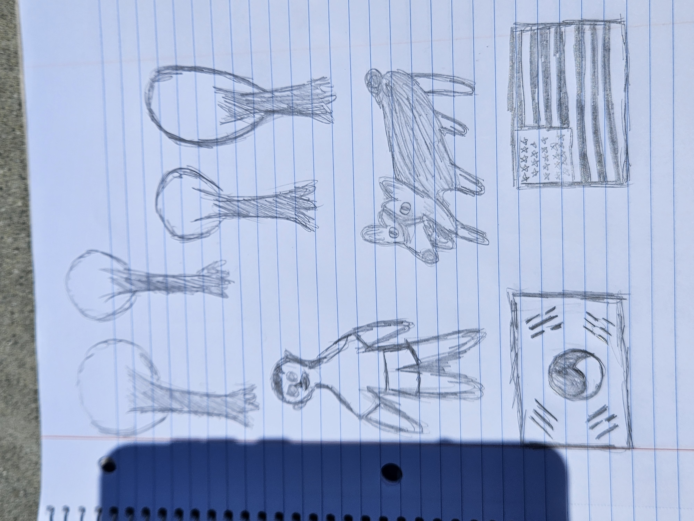

## William's page

## About me

Hello, I am William Lee. I am 16 years old junior at Del Norte High School. I am very interested in coding, so I decided to take this class. Even though I am new at coding, I will enjoy and try my best in this class.

## Freeform picture

This is the photo, which shows I am playing with my dog. When I have free time, I usually spend time playing with my dog. Under the photo, there are two flags; the one is Korea flag, and the other is America flag. They represent my dual identities. 